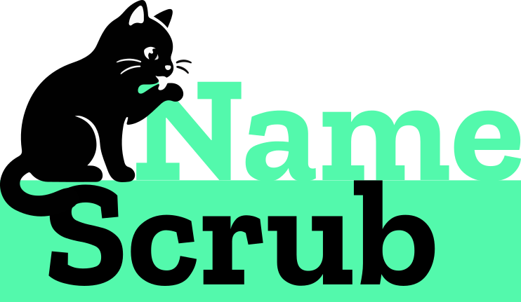

<div align="center">
  
  <br/><br/>
  <strong>Anonymisierung deutscher Texte — direkt im Browser.</strong>
</div>
<br/>

[](LICENSE)
[](https://vitejs.dev)
[](https://developer.mozilla.org/en-US/docs/Web/JavaScript)
[](https://namescrub.nozilla.net)
[](https://nozilla.de)

---

## Was ist NameScrub?

NameScrub erkennt potenzielle Eigennamen in deutschen Texten und ersetzt sie durch nummerierte Platzhalter — `Name-1`, `Name-2` usw. So bleibt der Text **lesbar und zusammenhängend**, Personen sind aber nicht mehr identifizierbar.

> **Datenschutzversprechen:** Kein Wort verlässt Ihren Browser. Keine API, kein Server, kein Logging.

---

## Features

- **Lokale Verarbeitung** — 100% Client-Side via Web Worker, keine Netzwerkanfragen nach dem Laden
- **Konsistente Anonymisierung** — jedes Vorkommen desselben Namens erhält denselben Platzhalter
- **Dreifach-Popup** — pro markiertem Wort: Löschen · Kein Name (False Positive) · Name-X ersetzen
- **Bulk-Modus** — „Alle ersetzen" nummeriert alle erkannten Namen automatisch
- **Honorific-Erkennung** — Wörter nach Herr / Frau / Dr. / Prof. werden priorisiert markiert
- **Satzanfang-Heuristik** — reduziert Fehlalarme bei deutschen Substantiven am Satzbeginn
- **233.000+ Wörter** aus [`enz/german-wordlist`](https://github.com/enz/german-wordlist) — ohne Eigennamen

---

## So funktioniert es

```
1. Text einfügen
2. „Analyse starten" klicken (oder Strg+Enter)
3. Grün markierte Wörter anklicken →
      [× Löschen]   [✓ Kein Name]   [↔ Name-1]
4. Oder: „Alle ersetzen" für vollautomatische Anonymisierung
5. „In Zwischenablage kopieren" — fertig
```

**Beispiel:**

| Vorher | Nachher |
|--------|---------|
| *Damian traf Maria am Montag. Später rief Damian nochmal an.* | *Name-1 traf Name-2 am Montag. Später rief Name-1 nochmal an.* |

---

## Tech Stack

| Schicht | Technologie |
|---------|-------------|
| Build | [Vite 5](https://vitejs.dev) |
| Sprache | Vanilla JavaScript (ES Modules) |
| Analyse | [Web Worker API](https://developer.mozilla.org/en-US/docs/Web/API/Web_Workers_API) |
| Wörterbuch | [`enz/german-wordlist`](https://github.com/enz/german-wordlist) |
| Design | [nozilla CI](https://nozilla.de) — Neo-Brutalism |
| Hosting | Plesk / Static Files |

---

## Lokale Entwicklung

```bash
# Repository klonen
git clone https://github.com/daimpad/namescrub.git
cd namescrub

# Abhängigkeiten installieren
npm install

# Wörterbuch aufbereiten (einmalig)
npm run build:dict

# Dev-Server starten
npm run dev
```

Öffne `http://localhost:5173` im Browser.

### Produktions-Build

```bash
npm run build:plesk
# → Ausgabe in /dist/ — Inhalt direkt in den Webserver-Root kopieren
```

---

## Deployment (Plesk)

Der Ordner `/dist` enthält alles — fertig gebaut, kein Node.js auf dem Server nötig:

```
dist/
├── index.html
├── .htaccess          # Apache: gzip, Caching, CSP
├── dictionary.json    # 675k Wörter (~2 MB gzipped)
└── assets/
    ├── main-[hash].js
    ├── main-[hash].css
    └── worker-[hash].js
```

Details: [`DEPLOY.md`](DEPLOY.md)

---

## Architektur

```
┌─────────────────────────────────┐
│           Browser               │
│                                 │
│  ┌─────────┐   ┌─────────────┐ │
│  │  app.js │──▶│  worker.js  │ │
│  │  (UI)   │◀──│  (Analyse)  │ │
│  └─────────┘   └──────┬──────┘ │
│                        │        │
│                 dictionary.json │
│                 (675k Wörter)   │
└─────────────────────────────────┘
         ↑
  Kein Netzwerk nach dem ersten Laden
```

---

## Lizenz

```
MIT License

Copyright (c) 2026 nozilla

Permission is hereby granted, free of charge, to any person obtaining a copy
of this software and associated documentation files (the "Software"), to deal
in the Software without restriction, including without limitation the rights
to use, copy, modify, merge, publish, distribute, sublicense, and/or sell
copies of the Software, and to permit persons to whom the Software is
furnished to do so, subject to the following conditions:

The above copyright notice and this permission notice shall be included in all
copies or substantial portions of the Software.

THE SOFTWARE IS PROVIDED "AS IS", WITHOUT WARRANTY OF ANY KIND, EXPRESS OR
IMPLIED, INCLUDING BUT NOT LIMITED TO THE WARRANTIES OF MERCHANTABILITY,
FITNESS FOR A PARTICULAR PURPOSE AND NONINFRINGEMENT. IN NO EVENT SHALL THE
AUTHORS OR COPYRIGHT HOLDERS BE LIABLE FOR ANY CLAIM, DAMAGES OR OTHER
LIABILITY, WHETHER IN AN ACTION OF CONTRACT, TORT OR OTHERWISE, ARISING FROM,
OUT OF OR IN CONNECTION WITH THE SOFTWARE OR THE USE OR OTHER DEALINGS IN THE
SOFTWARE.
```

---

<div align="center">

Ein Projekt von **[nozilla](https://nozilla.de)** — bits & bytes mit ❤

</div>
